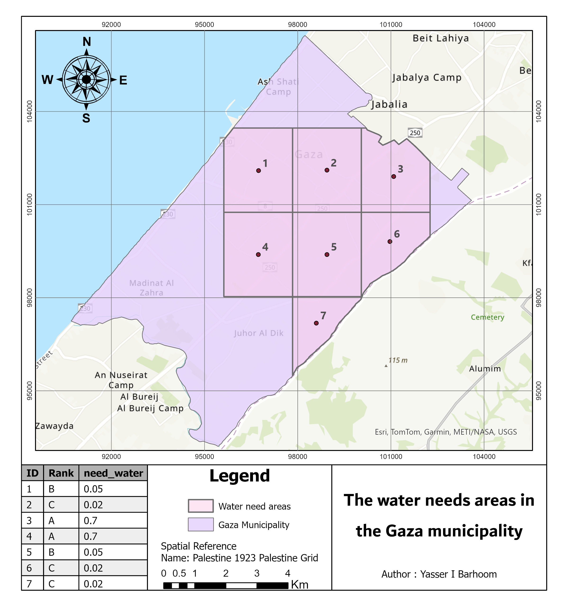
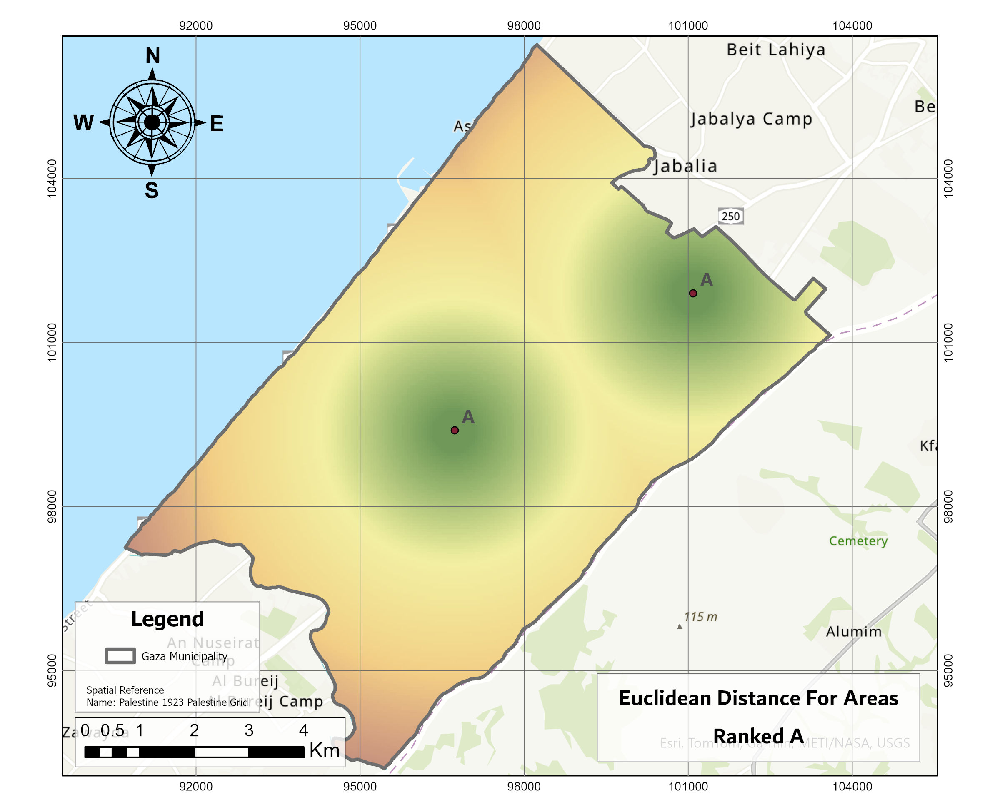
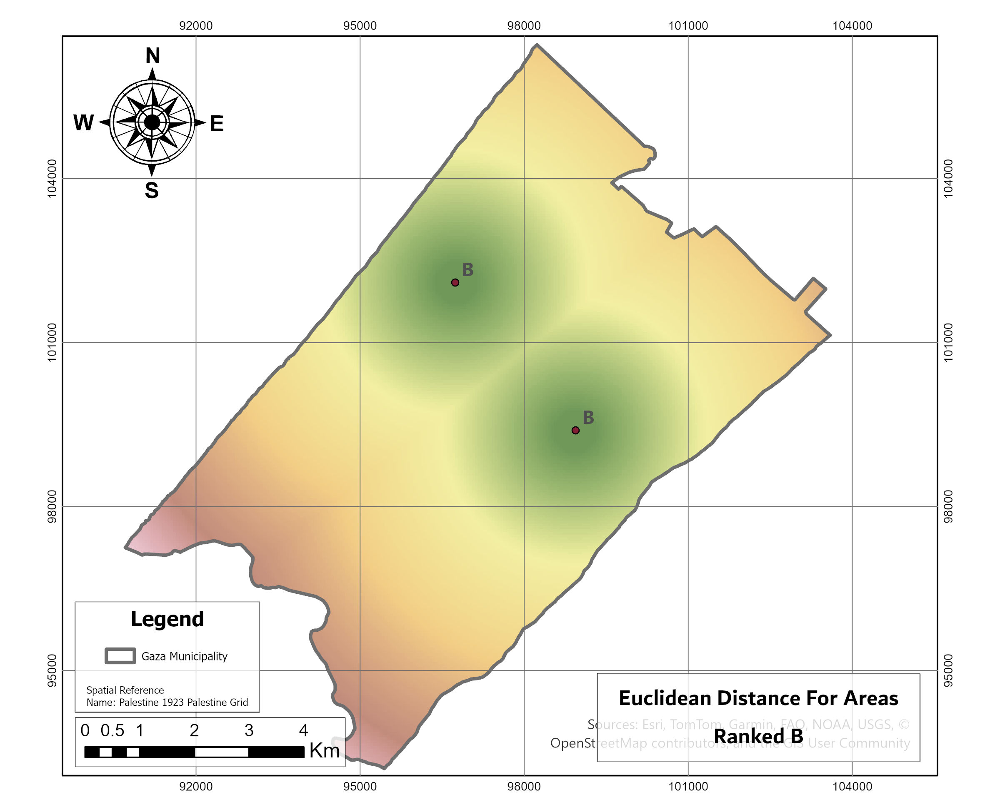
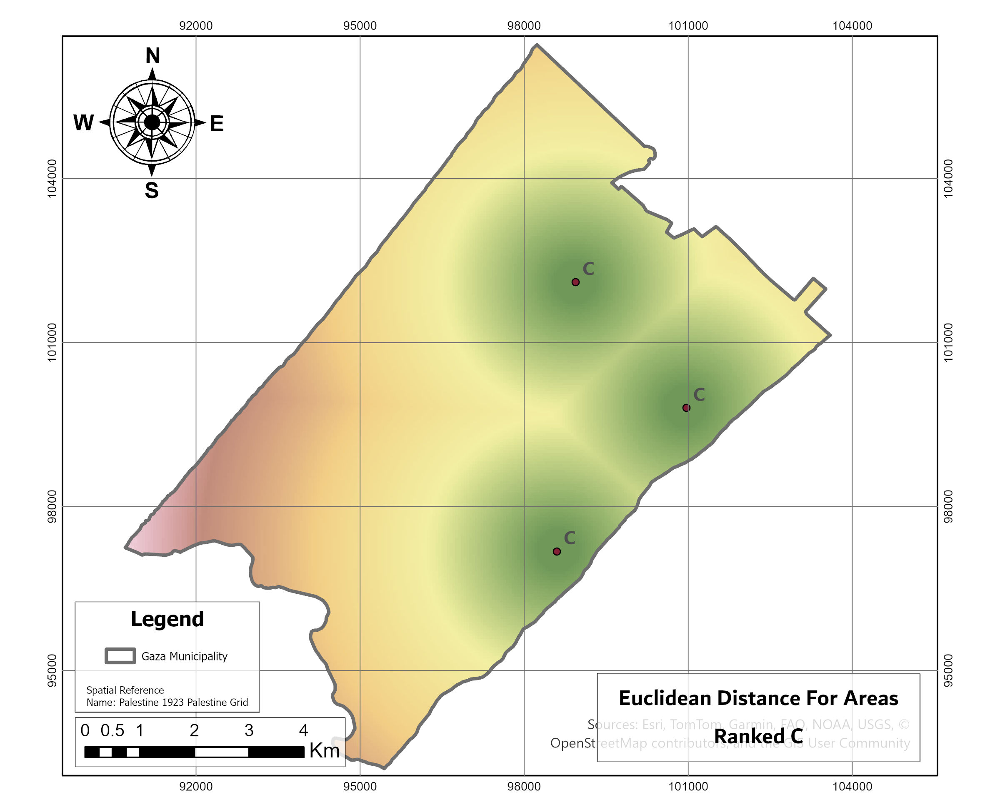

# 🚰 GIS-Based Site Selection for Water Wells – Gaza Municipality

This project presents a complete **spatial decision support model** to determine the **optimal locations for three new water wells** in Gaza Municipality using ArcGIS Pro. The analysis is conducted using **demo data** for academic and portfolio purposes and applies **weighted overlay modeling** with Euclidean distance and raster operations.

---

## 🎯 Project Goal

To identify the **best three locations** for constructing water wells by analyzing the spatial distribution of water demand across 7 zones. The goal is to prioritize regions with high need for improved water quality using a weighted, criteria-based GIS model.

> 📝 **Note**: The spatial data used in this project is **demo data** created for educational purposes only and does not represent actual conditions in Gaza.

---

## 📊 Data Overview

- **Study Area**: Gaza Municipality
- **Input Data**: Point shapefile representing 7 zone centroids (Demo)
- **Attribute**: Water need rank:
  - `A` – High Need
  - `B` – Medium Need
  - `C` – Low Need

### 🔢 Assigned Weights

| Rank | Need Type     | Weight |
|------|---------------|--------|
| A    | High          | 0.7    |
| B    | Medium        | 0.05   |
| C    | Low           | 0.02   |

---

## 🧭 Spatial Analysis Workflow

### 1️⃣ Water Need Distribution Map



- Visualizes ranked water demand across the 7 demo zones.
- Serves as the foundation for spatial modeling.

---

### 2️⃣ Euclidean Distance Calculation

Using **Euclidean Distance Tool** in ArcGIS for each rank class:

- `Dist_A`: Distance to high-need areas  
  

- `Dist_B`: Distance to medium-need areas  
  

- `Dist_C`: Distance to low-need areas  
  

---

### 3️⃣ Suitability Raster Calculation

Weighted overlay modeling using ArcGIS Raster Calculator:

```math
Suitability = (0.7 * Dist_A) + (0.05 * Dist_B) + (0.02 * Dist_C)
````

* Combined raster output for suitability:
  !\[Suitability Map]\(images/Suitability Analysis.jpg)

---

### 4️⃣ Final Output: Best Locations

Using the **Locate Regions Tool** to extract the **top 3 most suitable well locations**:

!\[Best 3 Water Wells]\(images/Best3Wells.jpg)

---

## 🧠 Skills Demonstrated

* Raster-based multi-criteria decision analysis (MCDA)
* Euclidean distance modeling
* Weighted overlay using ArcGIS Raster Calculator
* Site suitability modeling with GIS
* Map design and spatial visualization

---


### 👨‍💻 **Author**

* **Yasser I. Barhoom**
* **Geospatial Engineer**